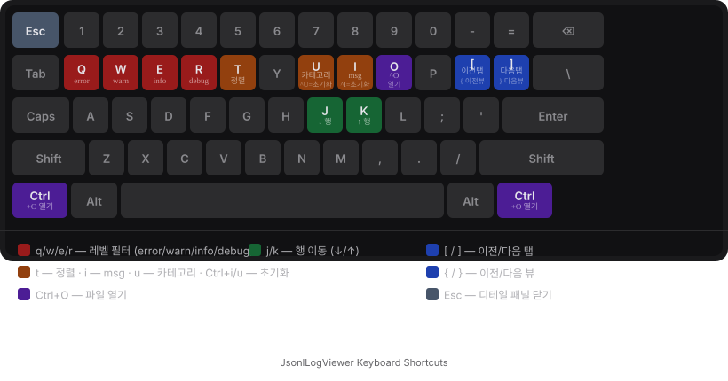

# JsonlLogViewer

JSONL(JSON Lines) 형식 로그 파일을 사람이 읽기 좋게 보여주는 로컬 데스크톱 뷰어입니다.  
Electron + React + TypeScript 기반이며 비개발직군(QA, 기획, 운영팀)도 설치 후 바로 사용할 수 있습니다.

---

## 요구사항

각 JSONL 줄은 아래 세 필드를 반드시 포함해야 합니다.

| 필드 | 타입 | 설명 |
|---|---|---|
| `timestamp` | string (ISO 8601) | 로그 발생 시각 |
| `level` | string (`error`/`warn`/`info`/`debug`) | 로그 레벨 |
| `msg` | string | 로그 메시지 |

`category` 필드는 선택 사항이며, 존재하면 목록에 표시됩니다.  
`schema` 필드가 있으면 해당 이름의 등록된 스키마와 먼저 매칭을 시도합니다.

---

## 주요 기능

- **멀티탭** — 여러 JSONL 파일을 탭으로 동시에 열기
- **실시간 Tail** — 파일이 변경되면 자동으로 새 줄 추가 (탭에 발광 점 표시)
- **스키마 플러그인** — JSON Schema + HTML 뷰어를 등록하면 행 클릭 시 커스텀 뷰어 표시
- **필터** — 레벨 체크박스, msg/카테고리 정규식, 타임스탬프 정렬
- **뷰 전환** — 로그 목록 / 통계 대시보드 / 타임라인 히스토그램 / Diff 비교
- **내보내기** — 필터된 결과를 CSV 또는 JSONL로 저장
- **세션 복원** — 앱 재시작 시 이전에 열었던 탭 자동 복원

---

## 개발 환경

```bash
# 의존성 설치
npm install

# 개발 서버 실행 (Electron 앱 열림)
npm run dev

# 빌드
npm run build

# 테스트
npm test
```

---

## 스키마 플러그인

스키마는 `%APPDATA%/jsonllogviewer-scaffold/schemas/<id>/` 에 저장됩니다.

```
schemas/
└── my-schema/
    ├── schema.json    # JSON Schema (required 필드 정의)
    ├── config.json    # { "name": "표시 이름" }
    └── viewer.html    # 커스텀 HTML 뷰어 (선택)
```

### 스키마 자동 힌트

로그 줄에 `schema` 필드가 있으면 해당 ID의 스키마를 **우선** 매칭합니다.

```json
{"timestamp":"...","level":"info","msg":"...","schema":"game-event","event_type":"login"}
```

### viewer.html 인터페이스

```js
window.addEventListener('message', e => {
  if (e.data.type !== 'LOG_DATA') return
  const row = e.data.payload  // 해당 줄의 JSON 객체
  // 자유롭게 렌더링
})
```

스키마 등록/편집은 앱 좌측 사이드바 **관리** 버튼, ZIP 내보내기/가져오기로 팀 공유 가능합니다.

---

## 키보드 단축키



| 키 | 동작 |
|---|---|
| `j` / `k` | 행 이동 (↓ / ↑) |
| `q` | error 레벨 토글 |
| `w` | warn 레벨 토글 |
| `e` | info 레벨 토글 |
| `r` | debug 레벨 토글 |
| `t` | 타임스탬프 정렬 방향 토글 |
| `i` | msg 정규식 입력 포커스 |
| `u` | 카테고리 정규식 입력 포커스 |
| `Ctrl+I` | msg 정규식 초기화 |
| `Ctrl+U` | 카테고리 정규식 초기화 |
| `Ctrl+O` | 파일 열기 |
| `[` / `]` | 이전 / 다음 탭 |
| `{` / `}` | 이전 / 다음 뷰 (로그→통계→타임라인→Diff) |
| `Escape` | 디테일 패널 닫기 |
| **Enter / Esc** *(입력창 내)* | 입력창 포커스 아웃 |

---

## 라이선스

MIT
